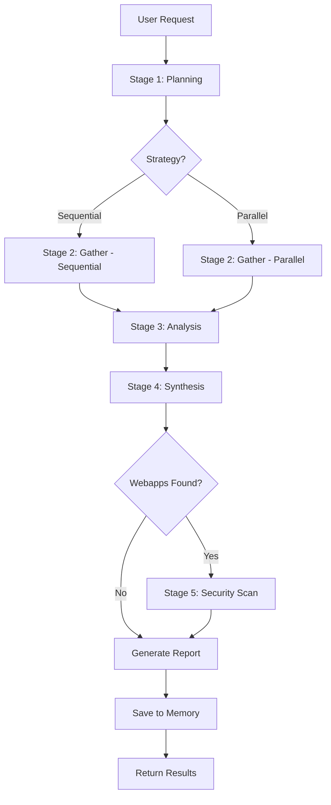

# Research Workflow

## Overview
Multi-stage autonomous research workflow that coordinates web research and optional security scanning.

## Workflow Stages

### Stage 1: Planning
**Objective**: Understand the research goal and create execution plan

**Actions**:
1. Parse user's research request
2. Identify key topics and sub-topics
3. Determine research strategy (broad vs. deep)
4. Identify potential sources
5. Estimate time and resources required

**Outputs**:
- Research plan document
- List of target domains/topics
- Execution strategy (sequential/parallel)

### Stage 2: Information Gathering
**Objective**: Collect data from multiple sources

**Sub-Agent**: `web_research`

**Actions**:
1. Execute search queries for each topic
2. Scrape identified sources
3. Extract relevant content
4. Follow promising links (up to configured depth)
5. Handle failures gracefully (retry, skip, alternative sources)

**Parallel Execution**:
```yaml
strategy: parallel
sub_agents:
  - web_research: topic_A
  - web_research: topic_B
  - web_research: topic_C
max_concurrent: 3
wait: all_complete
```

**Outputs**:
- Raw content from sources
- Metadata (URLs, timestamps, titles)
- Failed sources log

### Stage 3: Content Analysis
**Objective**: Process and structure gathered information

**Actions**:
1. De-duplicate content
2. Extract key information
3. Identify entities (people, organizations, technologies)
4. Extract key facts and statistics
5. Assess source credibility
6. Identify knowledge gaps

**Outputs**:
- Structured data
- Entity list
- Key findings
- Credibility scores

### Stage 4: Synthesis
**Objective**: Create coherent output from analyzed data

**Actions**:
1. Group findings by topic
2. Identify patterns and trends
3. Cross-reference information
4. Generate summary
5. Create citations/references
6. Highlight conflicting information

**Outputs**:
- Research report (Markdown)
- Executive summary
- Detailed findings by topic
- Source bibliography
- Data export (JSON)

### Stage 5: Optional - Security Assessment
**Objective**: If research involves web applications, assess security

**Sub-Agent**: `security_scan`

**Conditional Execution**:
```yaml
strategy: conditional
if: research_includes_webapps == true
then:
  spawn: security_scan
  with:
    targets: extracted_urls
    scan_type: passive
```

**Actions**:
1. Identify web application URLs from research
2. Run passive security scan
3. Identify obvious vulnerabilities
4. Generate security report

**Outputs**:
- Security scan report
- Vulnerability list
- Risk assessment

## Execution Flow



## Configuration

### Research Parameters
```yaml
research_config:
  max_sources: 50
  depth: 2
  time_limit: 600  # seconds
  parallel_workers: 3
  languages: ["en"]
  content_types: ["article", "blog", "documentation"]
```

### Output Formats
```yaml
output:
  formats:
    - markdown  # Research report
    - json      # Structured data
    - html      # Web-friendly report
  include_raw_data: false
  citation_style: "apa"
```

## Error Handling

### Failure Scenarios
1. **No sources found**
   - Broaden search terms
   - Try alternative search strategies
   - Use backup data sources

2. **Scraping failures**
   - Retry with different method (requests → Selenium)
   - Skip source and continue
   - Log for manual review

3. **Timeout**
   - Return partial results
   - Save progress to memory
   - Offer to continue later

4. **Memory/Resource limits**
   - Process in smaller batches
   - Reduce parallel workers
   - Prioritize most relevant sources

## Memory Integration

### Store in Memory
```yaml
memory_operations:
  - key: "research_history"
    value:
      topic: "..."
      timestamp: "..."
      sources_count: 42
      key_findings: [...]

  - key: "successful_sources"
    append:
      - domain: "example.com"
        reliability: 0.9
        response_time: "fast"

  - key: "failed_sources"
    append:
      - url: "..."
        reason: "cloudflare"
        attempted_methods: ["requests", "selenium"]
```

### Learn from History
- Check memory for similar past research
- Reuse successful source lists
- Avoid previously failed sources
- Apply learned patterns (e.g., "financial sites need JavaScript rendering")

## Example Workflow Execution

### Example 1: Technology Research
```
User: "Research AI coding assistants released in 2026"

Stage 1 - Planning:
  Topics: [AI assistants, code generation, 2026 releases]
  Strategy: Parallel
  Sources: [tech blogs, GitHub, product sites]

Stage 2 - Gathering (Parallel):
  Worker 1: AI assistant tools
  Worker 2: 2026 tech releases
  Worker 3: Code generation trends
  Results: 45 sources, 38 successful

Stage 3 - Analysis:
  Entities: [GitHub Copilot X, Claude Code, GPT-5 Developer]
  Key Facts: 15 major releases, 8 open-source
  Trends: Increased multimodal support

Stage 4 - Synthesis:
  Generated: 2,500 word report
  Sections: Overview, Tools, Comparison, Trends
  Citations: 38 sources

Stage 5 - Security: Skipped (no webapps)

Output: research_ai_assistants_20260324.md
```

### Example 2: Competitive Analysis with Security
```
User: "Research competitor webapp features and security"

Stage 1 - Planning:
  Topics: [competitor features, webapp analysis]
  Strategy: Sequential (security depends on research)
  Sources: [competitor sites, reviews, documentation]

Stage 2 - Gathering:
  URLs: [competitor1.com, competitor2.com, competitor3.com]
  Results: 25 pages scraped

Stage 3 - Analysis:
  Features identified: 47 across 3 competitors
  Webapps found: 3 URLs

Stage 4 - Synthesis:
  Feature comparison matrix created
  Webapp URLs logged for security scan

Stage 5 - Security:
  Spawned security_scan agent
  Scanned: 3 webapps (passive)
  Findings: 12 low, 3 medium issues

Output: 
  - competitive_analysis_20260324.md
  - security_scan_20260324.html
```

## Best Practices

1. **Always save to memory** - Future research benefits from past results
2. **Respect rate limits** - Don't overwhelm sources with requests
3. **Validate sources** - Check domain reputation and content quality
4. **Handle partial failures** - Return useful results even if not all sources succeed
5. **Be transparent** - Log all actions for user visibility
6. **Time-box execution** - Don't run indefinitely, return what you have
7. **Ask for clarification** - If research goal is unclear, ask before starting

## Integration Points

- **SOUL.md**: Inherit agent personality and communication style
- **AGENTS.md**: Sub-agent spawning and orchestration logic
- **MEMORY.md**: Store results and learn from history
- **TOOLS.md**: Tool configuration (browser, HTTP client)
- **USER.md**: User preferences for research depth, output format
- **skills/web_research**: Web scraping sub-agent
- **skills/security_scan**: Security assessment sub-agent

## Future Enhancements

- [ ] AI-powered content summarization
- [ ] Sentiment analysis on gathered content
- [ ] Automatic fact-checking and verification
- [ ] Multi-language research support
- [ ] Real-time research updates (streaming)
- [ ] Collaborative research (multiple users)
- [ ] Research templates for common use cases
- [ ] Integration with academic databases
- [ ] Citation management integration
- [ ] Visual data presentation (charts, graphs)